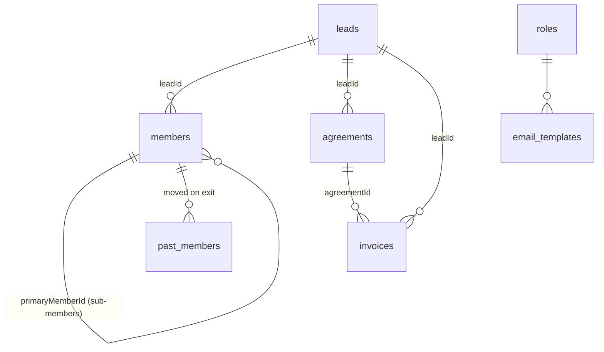

# Firestore Schema

## Collections Overview

```
├── leads               # CRM leads (prospects + converted clients)
├── members             # Active workspace members
├── past_members        # Archived members (after exit/termination)
├── agreements          # Client agreements/contracts
├── invoices            # Generated invoices
├── expenses            # Expense records
├── expense_categories  # Custom expense category names
├── roles               # RBAC role definitions
├── email_templates     # Customizable email templates
├── otps                # Temporary OTP storage (server-only)
└── logs                # Immutable activity/audit logs
```

---

## `leads`

Each lead represents a prospect that may be converted into a client (member).

| Field | Type | Description |
|---|---|---|
| `name` | string | Lead's full name |
| `status` | string | `"New"`, `"Contacted"`, `"Converted"` |
| `convertedEmail` | string | Email after conversion |
| `convertedWhatsapp` | string | WhatsApp number |
| `ccEmail` | string | CC email for invoices |
| `purposeOfVisit` | string | Package type (e.g. `"Dedicated Desk"`) |
| `memberAddress` | string | Address |
| `lastInvoiceDetails` | map | Cached last invoice data for quick regeneration |
| `createdAt` | timestamp | Creation timestamp |

---

## `members`

Active workspace members. Primary members link to a lead; sub-members link to a primary member.

| Field | Type | Description |
|---|---|---|
| `name` | string | Member name |
| `email` | string | Email address |
| `primary` | boolean | `true` if primary member |
| `leadId` | string | Reference to `leads` collection (primary only) |
| `primaryMemberId` | string | ID of primary member (sub-members only) |
| `company` | string | Company name |
| `package` | string | Package type |
| `subMembers` | array\<string\> | IDs of sub-members (primary only) |
| `createdAt` | timestamp | When member was added |

---

## `past_members`

Same schema as `members`, with additional fields:

| Additional Field | Type | Description |
|---|---|---|
| `removedAt` | timestamp | When they were moved to past |
| `reason` | string | Reason for removal |

---

## `agreements`

Client agreements/contracts tied to leads.

| Field | Type | Description |
|---|---|---|
| `leadId` | string | Reference to `leads` collection |
| `memberLegalName` | string | Legal name on agreement |
| `memberAddress` | string | Address on agreement |
| `agreementNumber` | string | Agreement identifier |
| `status` | string | `"active"`, `"terminated"` |
| `startDate` | string | Agreement start date (YYYY-MM-DD) |
| `endDate` | string | Agreement end date (YYYY-MM-DD) |
| `exitDate` | string | Actual exit date (if early exit) |

---

## `invoices`

Generated invoices associated with leads and agreements.

| Field | Type | Description |
|---|---|---|
| `leadId` | string | Reference to `leads` collection |
| `agreementId` | string | Reference to `agreements` collection |
| `invoiceNumber` | string | Auto-generated (e.g. `WCP2601001`) |
| `legalName` | string | Name on invoice |
| `address` | string | Billing address |
| `date` | timestamp | Invoice date |
| `month` | string | Billing month (e.g. `"January"`) |
| `year` | string | Billing year (e.g. `"2026"`) |
| `fromDate` | timestamp | Service period start |
| `toDate` | timestamp | Service period end |
| `items` | array\<map\> | Line items: `{description, sacCode, price, quantity}` |
| `totalPrice` | string | Price after discount |
| `discountAmount` | number | Discount in currency |
| `cgstPercentage` | number | CGST percentage |
| `sgstPercentage` | number | SGST percentage |
| `taxAmount` | string | Total tax amount |
| `totalAmountPayable` | string | Final payable amount |
| `paymentStatus` | string | `"Paid"` or `"Unpaid"` |
| `dateOfPayment` | timestamp | Payment date (when marked paid) |
| `createdAt` | timestamp | Server timestamp |
| `lastEditedAt` | timestamp | Last edit timestamp |

---

## `expenses`

Individual expense records.

| Field | Type | Description |
|---|---|---|
| `category` | string | Category name |
| `amount` | number | Expense amount |
| `date` | timestamp | Date of expense |
| `notes` | string | Optional notes |
| `billNumber` | string | Bill/receipt number |
| `addedBy` | string | Display name of user who added it |

---

## `expense_categories`

Custom expense categories.

| Field | Type | Description |
|---|---|---|
| `name` | string | Category name |

---

## `roles`

RBAC role definitions. Stored with custom IDs.

| Field | Type | Description |
|---|---|---|
| `name` | string | Role display name (e.g. `"Admin"`, `"Manager"`) |
| `permissions` | array\<string\> | List of permissions. `["all"]` = superadmin |

---

## `email_templates`

Customizable email templates. Document IDs: `otp_email`, `welcome_email`, `invoice_email`, `agreement_email`.

| Field | Type | Description |
|---|---|---|
| `subject` | string | Email subject (supports `{{placeholders}}`) |
| `body` | string | Email body (supports `{{placeholders}}`) |

---

## `otps`

Temporary OTP storage. Document ID = email address. Not client-accessible.

| Field | Type | Description |
|---|---|---|
| `otp` | string | 6-digit OTP code |
| `expiresAt` | timestamp | Expiration time (10 minutes) |

---

## `logs`

Immutable activity audit log. Created by client and Cloud Functions.

| Field | Type | Description |
|---|---|---|
| `timestamp` | timestamp | Server timestamp |
| `user` | map | `{uid, displayName}` of acting user |
| `action` | string | Action identifier (e.g. `"invoice_generated"`) |
| `message` | string | Human-readable description |
| `details` | map | Additional action-specific data |

---

## Relationships Diagram


