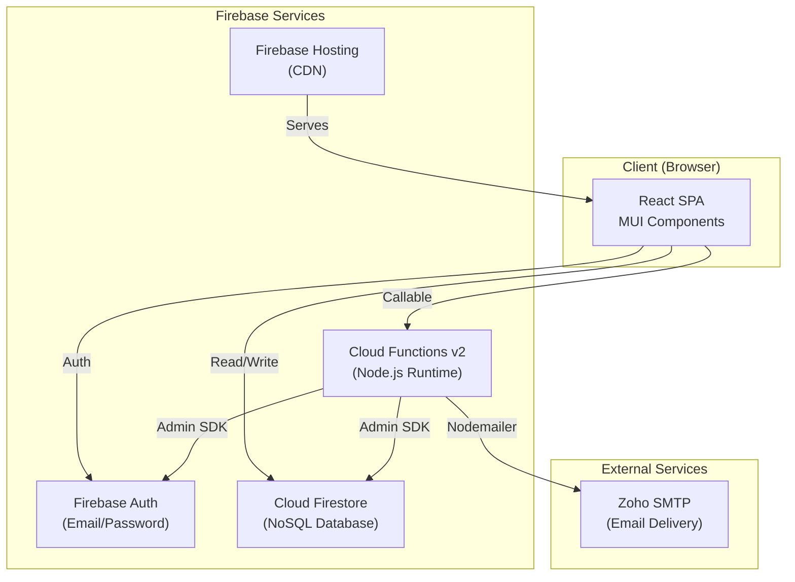
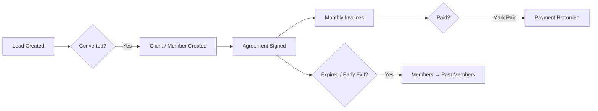

# High-Level Design (HLD)

## 1. System Overview

Trial Bench is a **CRM (Customer Relationship Management)** web application for managing coworking space operations — leads, members, agreements, invoices, and expenses. It is built as a **React SPA** hosted on **Firebase Hosting**, backed by **Firebase services**.

## 2. Architecture

## 3. Module Breakdown

| Module | Description | Key Operations |
|---|---|---|
| **Authentication** | Email/password login via Firebase Auth | Login, logout, password reset |
| **Leads** | CRM pipeline management | CRUD, status tracking, conversion to client |
| **Members** | Active workspace members | Add, edit, sub-members, replace primary |
| **Past Members** | Archived members | Auto-archive on agreement termination |
| **Agreements** | Client contracts | CRUD, PDF generation, email, early exit |
| **Invoices** | Billing & invoicing | Generate, edit, mark paid, PDF, email |
| **Expenses** | Expense tracking | CRUD, categories, reports (monthly/yearly) |
| **Settings** | Admin configuration | User mgmt, role mgmt, email templates |
| **Dashboard** | Overview widgets | Stats, charts, unpaid invoices, expiring agreements |
| **Logs** | Activity audit trail | Automatic logging of all critical actions |

## 4. Data Flow

## 5. Security Model

- **Authentication**: Firebase Auth (email/password)
- **Authorization**: RBAC via custom claims + Firestore role documents
- **Data Access**: Firestore Security Rules enforce permissions server-side
- **Cloud Functions**: Verify auth tokens and check permissions before executing
- **Secrets**: SMTP credentials stored as Firebase Functions secrets (not in code)

## 6. Hosting & Deployment

- **Frontend**: Firebase Hosting (global CDN, auto SSL)
- **Backend**: Firebase Cloud Functions v2 (auto-scaling, serverless)
- **Database**: Cloud Firestore (real-time NoSQL, multi-region)
- **Environments**: Dev (`trial-bench-dev-10946`) and Prod (`trial-bench--crm`)

## 7. Key Design Decisions

| Decision | Rationale |
|---|---|
| **Firebase over custom backend** | Serverless, low ops overhead, built-in auth/hosting |
| **Firestore over Realtime DB** | Better querying, scalable, offline support |
| **React CRA** | Simple setup, widely supported, easy deployment |
| **MUI component library** | Comprehensive, consistent, responsive design system |
| **Client-side PDF generation** | No server load, instant preview, uses pdf-lib |
| **Centralized DataContext** | Single fetch layer, avoids duplicate requests |
| **RBAC via Custom Claims** | Secure, embedded in JWT, enforced on every layer |
