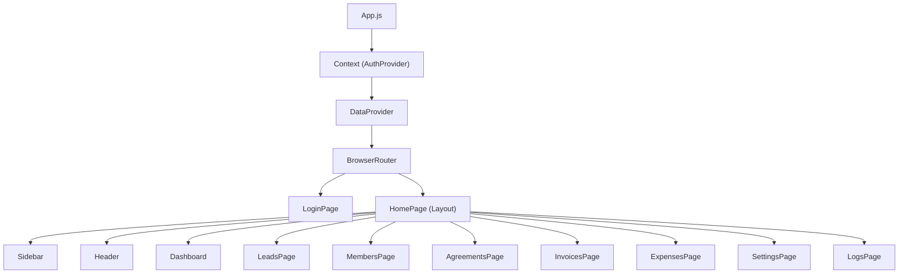
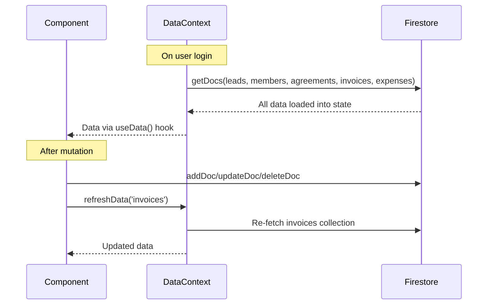
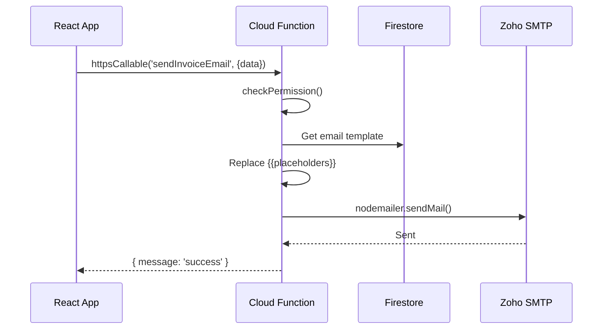
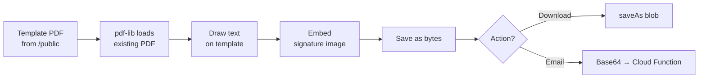
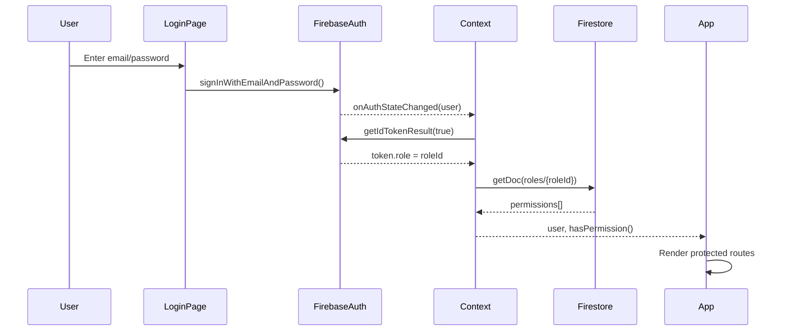

# Low-Level Design (LLD)

## 1. Frontend Architecture

### Component Hierarchy



### State Management

Two React Context providers handle global state:

| Provider | File | Responsibilities |
|---|---|---|
| `AuthContext` | `store/Context.js` | User auth state, custom claims, permissions, `hasPermission()` helper |
| `DataContext` | `store/DataContext.js` | All Firestore data (leads, members, agreements, invoices, expenses), loading states, `refreshData()` |

### Data Fetching Strategy



### Key Design Patterns

| Pattern | Usage |
|---|---|
| **Context + Provider** | Global auth and data state |
| **Custom Hooks** | `useData()`, `usePermissions()` |
| **Module CSS** | Scoped styles per component (`*.module.css`) |
| **Lazy Import** | `xlsx` and `pdf-lib` loaded on demand |
| **Optimistic UI** | Loading spinners per-item during mutations |

---

## 2. Cloud Functions Architecture

### Function Registry

| Function | Type | Permission | Description |
|---|---|---|---|
| `sendOtp` | `onCall` | `settings:manage_users` | Send OTP email for user creation |
| `verifyOtp` | `onCall` | `settings:manage_users` | Verify OTP code |
| `createUser` | `onCall` | `settings:manage_users` | Create Firebase Auth user |
| `updateUser` | `onCall` | `settings:manage_users` | Update user display name |
| `deleteUser` | `onCall` | `settings:manage_users` | Delete Firebase Auth user |
| `adminSetUserPassword` | `onCall` | `settings:manage_users` | Admin reset password |
| `setUserRole` | `onCall` | `settings:manage_users` | Assign RBAC role via Custom Claims |
| `listUsers` | `onCall` | `settings:manage_users` | List all Auth users |
| `sendWelcomeEmail` | `onCall` | `members:add` | Send welcome email to new member |
| `sendInvoiceEmail` | `onCall` | `invoices:add/edit` | Email invoice PDF |
| `sendAgreementEmail` | `onCall` | `agreements:edit` | Email agreement PDF |
| `earlyExitAgreement` | `onCall` | `agreements:edit` | Terminate agreement + move members |
| `replacePrimaryMember` | `onCall` | `members:edit` | Replace/promote primary member |
| `onRoleDeleted` | `onDocumentDeleted` | — | Revoke claims when role deleted |
| `scheduledAgreementTermination` | `onSchedule` | — | Daily check for expired agreements |

### Email Flow



### Transactional Operations

The `replacePrimaryMember` and `earlyExitAgreement` functions use **Firestore transactions/batches** to ensure atomicity:

- **earlyExitAgreement**: Uses `writeBatch` to terminate agreement + move all linked members to `past_members` atomically
- **replacePrimaryMember**: Uses `runTransaction` to promote/demote members + re-parent sub-members atomically

---

## 3. PDF Generation

PDFs are generated **client-side** using `pdf-lib`:



Template PDFs and signature images are stored in `/public/` and configured via environment variables.

---

## 4. Invoice Number Generation

Format: `WCP{YY}{MM}{SEQ}`

```
WCP2601001
 │  ││  └── Sequence (001, 002, ...)
 │  │└───── Month (01 = January)
 │  └────── Year (26 = 2026)
 └───────── Prefix
```

Generated by scanning existing invoices for the current month prefix and incrementing.

---

## 5. Authentication Flow



## 6. Responsive Design Strategy

| Breakpoint | Target | Behavior |
|---|---|---|
| `> 1025px` | Desktop | Full table layout, all columns visible |
| `768px – 1024px` | Tablet | Phone/notes columns hidden |
| `< 768px` | Mobile | Table → card layout, columns as key-value pairs |

Mobile card layout uses `data-label` attributes on `<td>` elements with CSS `::before` pseudo-elements to render labels.
