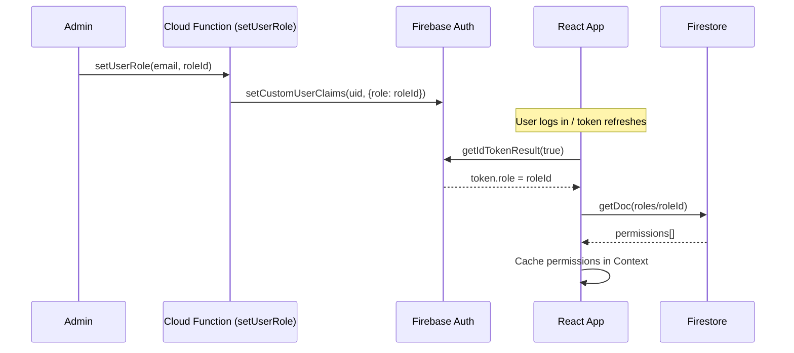

# RBAC & Permissions

## Overview

Trial Bench uses a **Role-Based Access Control** system. Roles are stored in Firestore (`roles` collection), and each user is assigned a role via Firebase Auth **Custom Claims** (`token.role` = role document ID).

## How It Works

## Permission Format

Permissions follow the pattern: `module:action`

## Permissions by Module

| Module | Permission | Description |
|---|---|---|
| **Leads** | `leads:view` | View all leads |
| | `leads:add` | Create new leads |
| | `leads:edit` | Edit lead details |
| | `leads:delete` | Delete leads |
| **Members** | `members:view` | View members list |
| | `members:add` | Add new members |
| | `members:edit` | Edit member details |
| | `members:delete` | Remove members |
| **Agreements** | `agreements:view` | View agreements |
| | `agreements:add` | Create agreements |
| | `agreements:edit` | Edit/terminate agreements |
| | `agreements:delete` | Delete agreements |
| **Invoices** | `invoices:view` | View invoices |
| | `invoices:add` | Generate invoices |
| | `invoices:edit` | Edit/mark invoices as paid |
| | `invoices:delete` | Delete invoices |
| **Expenses** | `expenses:view` | View expenses |
| | `expenses:add` | Add expenses |
| | `expenses:edit` | Edit expenses |
| | `expenses:delete` | Delete expenses |
| | `expenses:export` | Export expenses to Excel |
| | `expenses:view_reports` | View expense reports |
| | `expenses:manage_categories` | Add/edit/delete categories |
| **Settings** | `settings:manage_roles` | Manage RBAC roles |
| | `settings:manage_users` | Manage users (create/delete/assign roles) |
| | `settings:manage_templates` | Manage email templates |
| **Logs** | `logs:view` | View activity logs |
| **Special** | `all` | Superadmin — grants all permissions |

## Enforcement Layers

| Layer | How | File |
|---|---|---|
| **Frontend (UI)** | `hasPermission()` hides/disables UI elements | `usePermissions.js` |
| **Frontend (Routing)** | `<ProtectedRoute>` blocks page access | `ProtectedRoute.js` |
| **Firestore Rules** | Server-side read/write enforcement | `firestore.rules` |
| **Cloud Functions** | `checkPermission()` validates callable requests | `functions/index.js` |

## Role Examples

| Role | Key Permissions |
|---|---|
| **Admin** | `["all"]` |
| **Manager** | Most permissions except `settings:manage_users` |
| **Accountant** | `invoices:*`, `expenses:*`, `leads:view` |
| **Viewer** | `*:view` only |
