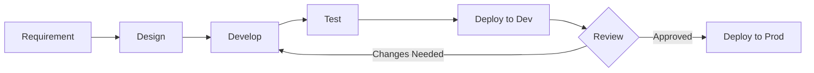

# Software Development Life Cycle (SDLC)

## Methodology

Trial Bench follows an **Agile/Iterative** development approach with continuous deployment to Firebase.

## Development Workflow

## Phases

### 1. Requirements Gathering
- Gather client requirements (features, business rules)
- Document in a task/issue tracker
- Identify RBAC permissions needed

### 2. Design
- Update HLD/LLD if architectural changes are needed
- Design Firestore schema for new collections/fields
- Plan Firestore security rules
- Design UI wireframes if needed

### 3. Development
- **Frontend**: Build React components using MUI
- **Backend**: Write Cloud Functions for server-side logic
- **Security**: Update Firestore rules and RBAC permissions
- Follow existing patterns (DataContext, module CSS, permission checks)

### 4. Testing
- Test locally with `npm start` (frontend) and Firebase Emulator (functions)
- Verify RBAC by logging in with different roles
- Test responsive design (mobile/tablet/desktop)
- Verify Firestore security rules

### 5. Deployment
- Deploy to **dev** environment first: `firebase use dev && firebase deploy`
- Verify on dev
- Deploy to **production**: `firebase use default && firebase deploy`
- Monitor Cloud Functions logs

### 6. Monitoring & Maintenance
- Check Cloud Functions logs: `firebase functions:log`
- Review activity logs in the app (Logs page)
- Monitor Firestore usage in Firebase Console

## Environment Strategy

| Environment | Firebase Project | Branch | Purpose |
|---|---|---|---|
| Development | `trial-bench-dev-10946` | `dev` / feature branches | Active development & testing |
| Production | `trial-bench--crm` | `main` | Live client-facing deployment |

## Coding Standards

| Area | Standard |
|---|---|
| **Components** | Functional components with hooks |
| **Styling** | CSS Modules (`.module.css`) |
| **State** | React Context (AuthContext + DataContext) |
| **Permissions** | Always check with `hasPermission()` before UI rendering and data operations |
| **Error Handling** | Try-catch with user-friendly toast notifications (sonner) |
| **Date Handling** | Use `dayjs` library; convert Firestore Timestamps with `.toDate()` |
| **Logging** | Use `logActivity()` for audit-worthy actions |

## Adding a New Feature Checklist

- [ ] Define required permissions
- [ ] Add permissions to relevant roles in Firestore
- [ ] Update Firestore security rules
- [ ] Create/update React components
- [ ] Add route in `App.js` with `<ProtectedRoute>`
- [ ] Add data fetching to `DataContext.js` (if new collection)
- [ ] Update documentation (schema, RBAC, API docs)
- [ ] Test with multiple roles
- [ ] Deploy to dev → verify → deploy to prod
